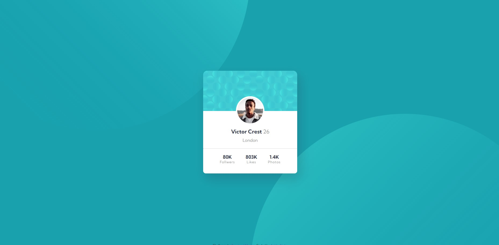

# Frontend Mentor - Profile card component solution

This is a solution to the [Profile card component challenge on Frontend Mentor](https://www.frontendmentor.io/challenges/profile-card-component-cfArpWshJ). Frontend Mentor challenges help you improve your coding skills by building realistic projects. 

## Table of contents

- [Overview](#overview)
  - [The challenge](#the-challenge)
  - [Screenshot](#screenshot)
  - [Links](#links)
- [My process](#my-process)
  - [Built with](#built-with)
  - [What I learned](#what-i-learned)
  - [Continued development](#continued-development)
- [Author](#author)

## Overview

### The challenge

- Build out the project to the designs provided

### Screenshot

### Links

- Solution URL: [Add solution URL here](https://www.frontendmentor.io/solutions/profile-card-component-6szpxkbirE)
- Live Site URL: [Add live site URL here](https://aghlaabdo.github.io/Profile-card-component/)

## My process

### Built with

- Semantic HTML5 markup
- CSS custom properties
- Flexbox

### What I learned

I just completed the Frontend Mentor profile card component challenge, and it was a great learning experience for me. By working on this project, I got better at using CSS flexbox to make responsive layouts. 

### Continued development

Those challenges from Frontend Mentor really keep me motivated to complete every challenge I started, and I have set a challenge to complete all the challeges in thier website. I don't know how much time would that take me, but I'm sure if I completed all of those challeges my skills would be much much better.

## Author

- Website - [aghlaabdo.com](https://www.aghlaabdo.com)
- Frontend Mentor - [@Aghlaabdo](https://www.frontendmentor.io/profile/Aghlaabdo)
- Twitter - [@aghla_abdo](https://twitter.com/aghla_abdo)
